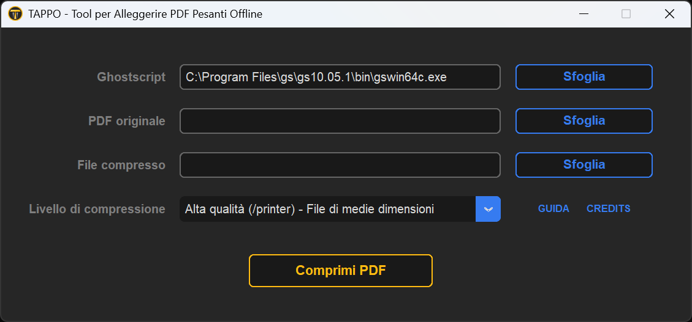

# TAPPO

### Tool per Alleggerire PDF Pesanti Offline | Trim And Pack PDFs Offline

**[Italiano](#italiano)** | **[English](#english)**

---

## Italiano

TAPPO è un semplice compressore di file PDF scritto in Python con un'interfaccia grafica.



### Requisiti

Questa applicazione richiede l'installazione di **Ghostscript** sul sistema operativo dell'utente.  
Ghostscript è un interprete per i formati PostScript (PS) e PDF.

#### Installazione di Ghostscript

##### Windows

1. Vai al sito ufficiale di Ghostscript: [https://ghostscript.com/download/gsdnld.html](https://ghostscript.com/download/gsdnld.html)
2. Scarica il pacchetto Windows a 64 bit (es: `gs###w64.exe`).
3. Esegui il programma di installazione e segui le istruzioni.

##### Linux

###### Debian/Ubuntu (e derivate)
```bash
sudo apt update
sudo apt install ghostscript
```

###### Fedora
```bash
sudo dnf install ghostscript
```

###### Arch Linux / Manjaro
```bash
sudo pacman -S ghostscript
```

###### openSUSE
```bash
sudo zypper install ghostscript
```

Se Ghostscript non è disponibile nei repository, è possibile scaricare il pacchetto Snap: [https://ghostscript.com/releases/gsdnld.html](https://ghostscript.com/releases/gsdnld.html)

#### Requisiti Python

```bash
pip install -r requirements.txt
```

### Problemi noti

- Corretta assegnazione dell'[icona .png nell'AppImage](https://github.com/Ghizza/TAPPO/issues/2)

### Contributi

Contributi benvenuti! Vedi [CONTRIBUTING.md](./CONTRIBUTING.md) per le linee guida.

### Licenza

Questo progetto è rilasciato sotto licenza MIT. Vedi il file [LICENSE](./LICENSE) per i dettagli.

---

## English

TAPPO is a simple PDF file compressor written in Python with a graphical user interface.


## Requirements

This application requires **Ghostscript** to be installed on the user's operating system.  
Ghostscript is an interpreter for PostScript (PS) and PDF formats.

### Installing Ghostscript

#### Windows

1. Go to the official Ghostscript website: [https://ghostscript.com/download/gsdnld.html](https://ghostscript.com/download/gsdnld.html)
2. Download the 64-bit Windows package (e.g., `gs###w64.exe`).
3. Run the installer and follow the instructions.

#### Linux

##### Debian/Ubuntu (and derivatives)
```bash
sudo apt update
sudo apt install ghostscript
```

##### Fedora
```bash
sudo dnf install ghostscript
```

##### Arch Linux / Manjaro
```bash
sudo pacman -S ghostscript
```

##### openSUSE
```bash
sudo zypper install ghostscript
```

If Ghostscript is not available in the repositories, you can download the Snap package: [https://ghostscript.com/releases/gsdnld.html](https://ghostscript.com/releases/gsdnld.html)

### Python Requirements

```bash
pip install -r requirements.txt
```

## Known Issues

- Correct assignment of the [.png icon in the AppImage](https://github.com/Ghizza/TAPPO/issues/2)

## Contributing

Contributions are welcome! See [CONTRIBUTING.md](./CONTRIBUTING.md) for guidelines.

## License

This project is released under the MIT License. See the [LICENSE](./LICENSE) file for details.
